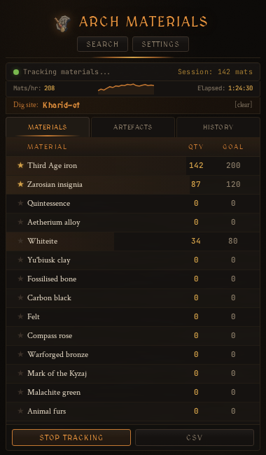
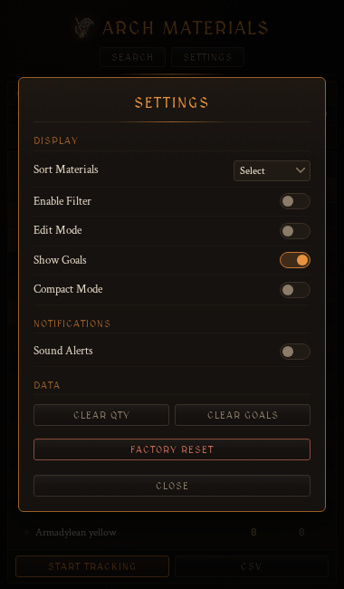
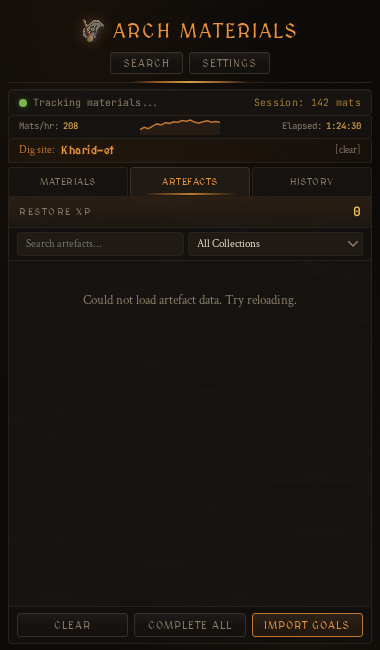
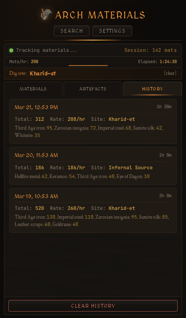

# RS3 Archaeology Material Counter

An [Alt1 Toolkit](https://runeapps.org/alt1) plugin for tracking archaeology materials in RuneScape 3. Reads your chatbox in real time to automatically count materials as you excavate.

## Install

Paste the following URL into Alt1's browser or URL bar:

```
alt1://addapp/https://jb-darnic.github.io/rs3-arch-mat-counter/appconfig.json
```

Requires [Alt1 Toolkit](https://runeapps.org/alt1) with **pixel** and **overlay** permissions.

## Features

**Core Tracking**
- Automatic material detection via ChatBox reading — supports normal finds, auto-screener, familiar, porter, imp-souled, and bank messages
- Fortune perk (2x) and Balarak (2x) multiplier handling, including the 4x combo
- Artefact calculator with material requirements and restoration XP totals
- Material data and artefact data pulled live from the [RS3 Wiki](https://runescape.wiki) and cached locally

**Goals & Progress**
- Set material goals from the artefact calculator or manually
- Progress bars behind each material row showing goal completion
- Time-to-goal estimates based on your current session rate
- Alt1 overlay notifications when a goal is reached

**Quality of Life**
- Live rate tracker (mats/hr) with sparkline graph
- Dig site auto-detection from chat — filters the material list to your current site
- Material pinning to keep important materials at the top
- Compact mode for smaller windows
- Search and filter (Ctrl+F, filter by quantity or goals)
- CSV export

**Session & History**
- Session history panel logging past sessions with per-material breakdowns
- Sound alerts on material finds and goal completions (configurable volume)
- Collection log tracking progress across artefact collections

## Screenshots

<p align="center">
  
  &nbsp;&nbsp;
  
</p>
<p align="center">
  
  &nbsp;&nbsp;
  
</p>

## Credits

- Material and artefact data sourced from the [RuneScape Wiki](https://runescape.wiki)
- Built for use with [Alt1 Toolkit](https://runeapps.org/alt1) by [Skillbert](https://runeapps.org)
- Inspired by [zerogwafa's ArchMatCounter](https://github.com/zerogwafa/ArchMatCounter)

## License

MIT
